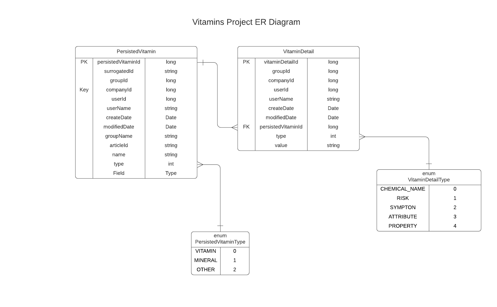

<div dir="rtl">
بسمه تعالی
<h1>
راهنمای ایجاد headless api  در سیستم لایفری
</h1>
هدف از این راهنما، ایجاد یک headless api  در سیستم لایفری می باشد. 
<br>
بنابراین از توضیحات اضافی در مورد مفاهیمی مانند Rest, API, ... اجتناب می شود.

<br>
توجه شود که در مراحلی که از طریق blade  دستوری اجرا می شود، برای هماهنگی شدن intellij  بایستی یک بار پروژه از طریق منوی زیر دوباره refresh شود.
</div>

```
Gradle -> Reload All Gradle Projects
```
<div dir="rtl">
منوی Gradle در سمت راست صفحه قرار دارد.
<br>
<br>
<h2>
ایجاد workspace
</h2>
<br>
یک workspace با مشخصات زیر ایجاد می کنیم.
</div>

```
workspace name : vitamins
liferay version: portal-7.3-ga8
```
<div dir="rtl">
برای ایجاد workspace می توانیم از دو روش استفاده کنیم.
<h3>
<br>
روش اول: استفاده از blade
</h3>
دستور زیر را در ترمینال اجرا کنید.
</div>

``` bash
blade init -v portal-7.3-ga8 vitamins
```
<div dir="rtl">
 <h3>
 روش دوم: با استفاده از intellij (توصیه می شود.)
 </h3>
<br>
در این روش ار طریق منوی زیر یک workspace با مشخصات ذکر شده ایجاد می کنیم.
<br>
<br>
</div>

```
File -> New -> Project -> Liferay -> Liferay Gradle Workspace
```
<div dir="rtl">

در این مرجله باید initBundle  انجام شود.
</br>
</br>
<h2>
ساخت ماژول headess-vitamins
</h2>
</br>
یک ماژول با مشخصات زیر بسازید.
</div>

```text
Package name: com.denbinger.vitamins
Template: rest-builder
Module name: headless-vitamins
```
<div dir="rtl">
<br>
همانند مرحله ی قبل، دو روش برای ایجاد ماژول داریم.

<h3>
روش اول: blade
</h3>
<br>
</div>

``` bash
cd  modules
blade create -t rest-builder -p com.denbinger.vitamins headless-vitamins
```
<div dir="rtl">
<h3>
روش دوم: با استفاده از intellij (توصیه می شود.)
</h3>
<br>
از طریق منوی زیر ماژول مورد نظر را بسازید.
توجه کنید که قالب rest-builder را انتخاب کنید.
<br>
<br>
</div>

```
File -> New -> Liferay Module
```

<div dir="rtl">
همان طور که مشاهده می کنید، داخل ماژول headless-vitamins چهار زیر ماژول api, client, impl, test  ایجاد شده است.
<br>
برای پیاده سازی endpint  ها فقط کافیست فایل rest-openapi.yaml  را مطایق استاندارد OpenAPI ویرایش کنید.
<br>
برای این کار پیشنهاد می کنیم از swagger  و یا پلاگین های مربوط به sswagger  در intellij  استفاده کنید تا درک آسان تری نسبت به مفاهیم موجود داشته باشید.
<br>
<h2>
تعریف Components و Paths
</h2>
به صورت کلی، دو کامپوننت به نام ویتامین (Vitamin) و سازنده (Creator) داریم.
فایل rest-openapi.yaml به صورت زیر خواهد بود.
<br>
Path های نیز سعی بر این شده تا حداکثر قوانین RestFul را رعایت کنند.
</div>


### rest-openapi.yaml
``` yaml
info:
    description: "HeadlessVitamins REST API"
    license:
        name: "Apache 2.0"
        url: "http://www.apache.org/licenses/LICENSE-2.0.html"
    title: "HeadlessVitamins"
    version: v1.0
openapi: 3.0.1
components:
    schemas:
        Vitamin:
            description: Contains all of the data for a single vitamin or mineral.
            properties:
                name:
                    description: The vitamin or mineral name.
                    type: string
                id:
                    description: The vitamin or mineral internal ID.
                    type: string
                chemicalNames:
                    description: The chemical names of the vitamin or mineral if it has some.
                    items:
                        type: string
                    type: array
                properties:
                    description: The chemical properties of the vitamin or mineral if it has some.
                    items:
                        type: string
                    type: array
                group:
                    description: The group the vitamin or mineral belongs to, i.e. the B group or A group.
                    type: string
                description:
                    description: The description of the vitamin or mineral.
                    type: string
                articleId:
                    description: A journal articleId if there is a web content article for this vitamin.
                    type: string
                type:
                    description: The type of the vitamin or mineral.
                    enum: [Vitamin, Mineral, Other]
                    type: string
                attributes:
                    description: Health properties attributed to the vitamin or mineral.
                    items:
                        type: string
                    type: array
                risks:
                    description: Risks associated with the vitamin or mineral.
                    items:
                        type: string
                    type: array
                symptoms:
                    description: Symptoms associated with the vitamin or mineral deficiency.
                    items:
                        type: string
                    type: array
                creator:
                    $ref: "#/components/schemas/Creator"
            type: object
        Creator:
            description: Represents the user account of the content's creator/author. Properties follow the [creator](https://schema.org/creator) specification.
            properties:
                additionalName:
                    description: The author's additional name (e.g., middle name).
                    readOnly: true
                    type: string
                familyName:
                    description: The author's surname.
                    readOnly: true
                    type: string
                givenName:
                    description: The author's first name.
                    readOnly: true
                    type: string
                id:
                    description: The author's ID.
                    format: int64
                    readOnly: true
                    type: integer
                image:
                    description: A relative URL to the author's profile image.
                    format: uri
                    readOnly: true
                    type: string
                name:
                    description: The author's full name.
                    readOnly: true
                    type: string
                profileURL:
                    description: A relative URL to the author's user profile.
                    format: uri
                    readOnly: true
                    type: string
            type: object
paths:
  "/vitamins":
    get:
      operationId: getVitaminsPage
      tags: ["Vitamin"]
      description: Retrieves the list of vitamins and minerals. Results can be paginated, filtered, searched, and sorted.
      parameters:
        - in: query
          name: filter
          schema:
            type: string
        - in: query
          name: page
          schema:
            type: integer
        - in: query
          name: pageSize
          schema:
            type: integer
        - in: query
          name: search
          schema:
            type: string
        - in: query
          name: sort
          schema:
            type: string
      responses:
        200:
          description: ""
          content:
            application/json:
              schema:
                items:
                  $ref: "#/components/schemas/Vitamin"
                type: array
            application/xml:
              schema:
                items:
                  $ref: "#/components/schemas/Vitamin"
                type: array
    post:
      operationId: postVitamin
      tags: ["Vitamin"]
      description: Create a new vitamin/mineral.
      requestBody:
        content:
          application/json:
            schema:
              $ref: "#/components/schemas/Vitamin"
          application/xml:
            schema:
              $ref: "#/components/schemas/Vitamin"
      responses:
        200:
          description: ""
          content:
            application/json:
              schema:
                $ref: "#/components/schemas/Vitamin"
            application/xml:
              schema:
                $ref: "#/components/schemas/Vitamin"
  "/vitamins/{vitaminId}":
    get:
      operationId: getVitamin
      tags: ["Vitamin"]
      description: Retrieves the vitamin/mineral via its ID.
      parameters:
        - name: vitaminId
          in: path
          required: true
          schema:
            type: string
      responses:
        200:
          description: ""
          content:
            application/json:
              schema:
                $ref: "#/components/schemas/Vitamin"
            application/xml:
              schema:
                $ref: "#/components/schemas/Vitamin"
    put:
      operationId: putVitamin
      tags: ["Vitamin"]
      description: Replaces the vitamin/mineral with the information sent in the request body. Any missing fields are deleted, unless they are required.
      parameters:
        - name: vitaminId
          in: path
          required: true
          schema:
            type: string
      requestBody:
        content:
          application/json:
            schema:
              $ref: "#/components/schemas/Vitamin"
          application/xml:
            schema:
              $ref: "#/components/schemas/Vitamin"
      responses:
        200:
          description: Default Response
          content:
            application/json:
              schema:
                $ref: "#/components/schemas/Vitamin"
            application/xml:
              schema:
                $ref: "#/components/schemas/Vitamin"
    patch:
      operationId: patchVitamin
      tags: ["Vitamin"]
      description: Replaces the vitamin/mineral with the information sent in the request body. Any missing fields are deleted, unless they are required.
      parameters:
        - name: vitaminId
          in: path
          required: true
          schema:
            type: string
      requestBody:
        content:
          application/json:
            schema:
              $ref: "#/components/schemas/Vitamin"
          application/xml:
            schema:
              $ref: "#/components/schemas/Vitamin"
      responses:
        200:
          description: ""
          content:
            application/json:
              schema:
                $ref: "#/components/schemas/Vitamin"
            application/xml:
              schema:
                $ref: "#/components/schemas/Vitamin"
    delete:
      operationId: deleteVitamin
      tags: ["Vitamin"]
      description: Deletes the vitamin/mineral and returns a 204 if the operation succeeds.
      parameters:
        - name: vitaminId
          in: path
          required: true
          schema:
            type: string
      responses:
        204:
          description: ""
          content:
            application/json: {}

```

<div dir="rtl">
در این مرحله با اجرای buildRest  از منوی Gradle کامپوننت ها و endpoint  های تعریف شده ساخته می شوند.
توجه شود که buildRest را فقط برای ماژول impl اجرا کنید.
</div>

```
Gradle -> modules -> headless-vitamins -> headless-vitamins-impl -> Tasks -> build -> buildRest
```

<div dir="rtl">
توجه کنید که restBuild  برای ایجاد کلاس ها، به قسمت tags
نباز دارد. 
<br>
بعد از اجرای restBuild زیرماژول های api, test, impl, client کامل می شوند.
<br>
//todo complete explanation about api test impl client
<br>
در این مرحله بخش endpoint
  ها کامل شده است ولی برای برقراری ارتباط با دیتابیس و لایه ی persistence
   نیاز به یک service  داریم.
<br>
   در این مرحله برای تست بخش api، بعد از deploy
     کردم ماژول به طریقه ی زیر عمل می کنیم.
<br>
<h2>
تست برقراری ارتباط با headless api 
</h2>
تست ارتباط با headless api به دو طریق انجام می شود.
 درخواستی مبنی بر دریافت مستندات api
  ارسال می کنیم. برای عبور از لایه امنیتی از یورز و پسورد ادمین استفاده میکنیم. توجه کنید که برای احراز هویت از استاندارد basicAuth استفاده می کنیم.
  <h3>
روش اول: curl 
</h3>
</div>

```
curl -u "LOGIN:PASSWORD" "http://localhost:8080/o/headless-vitamins/v1.0/openapi
.yaml"
```
<div dir="rtl">
که به جای LOGIN و PASSWORD
 به ترتیب ایمیل و رمز عبور لایفری خود را وارد می کنید. 
<h3>
روش دوم: Postman
</h3>
در خواستی از نوع GET و به آدرس زیر ارسال کرده و از تب Authorization
 نوع احراز را Basic Auth انتخاب کنیدو نام کاربری و رمز عبور خود را وارد کنید.
 <br>
 اگر در هر یک از روش های بالا،داده های زیر را دریافت کردید، لایه ی headless
  api
   شما به درستی کار می کند.
   <br>
   </div>

```yaml
openapi: 3.0.1
info:
  title: HeadlessVitamins
  description: HeadlessVitamins REST API
  license:
    name: Apache 2.0
    url: http://www.apache.org/licenses/LICENSE-2.0.html
  version: v1.0
servers:
- url: http://localhost:8080/o/headless-vitamins/
paths:
  /v1.0/openapi.{type}:
    get:
      operationId: getOpenAPI
      parameters:
      - name: type
        in: path
        required: true
        schema:
          type: string
      responses:
        default:
          description: default response
          content:
            application/json: {}
            application/yaml: {}
```
   <div dir="rtl">
   <br>
   برای ارتباط با دیتابیس، به یک persistence
     نیاز داریم(service layer) که به وسیله ی service builder ساخته می شود.
     <br>
     <h2>
     پیاده سازی لایه service</h2>
     همانند ایجاد headless vitamins، از دو طریق می توان این ماژول را ایجاد کرد.
     <br>
     یک ماژول با مشخصات زیر ایجاد کنید.
</div>

```text
Package name: com.denbinger.vitamins
Template: service-builder
Module name: vitamins
```


```text
Hint !

    With blade :
blade create -t service-bilder -p com.denbinger.vitamins vitamins

    With Intellij
File -> new -> Liferay Module 
```
<div dir="rtl">
در بخش شماتیک های کامپوننت ها در headless
  مشاهده کردید که هر ویتامین دارای نام (name)،  
</div>

